- Project folder: labs02/django/movie  
- Django Python Web server   
  - Ref: https://youtu.be/EuBQU_miReM   
- see the bottom for 
  Django REST Framework - Build an API server     

## TOC   
- [setup the virtual env & install `Django`](#setup-the-virtual-env--install-django)
- [start a Django project](#start-a-django-project)
- [google a Django .gitignore file](#google-a-django-gitignore-file)
- [start web server (in `bash` for this time)](#start-web-server-in-bash-for-this-time)
- [urlpatterns list routes URLs to views](#urlpatterns-list-routes-urls-to-views)
- [create views - response with message](#create-views---response-with-message)
- [create views - render the template](#create-views---render-the-template)
- [mock data from dictionary](#mock-data-from-dictionary)
- [Migrate & createsuperuser (password)](#migrate--createsuperuser-password)
- [Define Movie data model (db.sqlite3)](#define-movie-data-model-dbsqlite3)
- [Add the new table Movie to Admin page](#add-the-new-table-movie-to-admin-page)
- [Query data from the database](#query-data-from-the-database)
- [Detail View/Template](#detail-viewtemplate)
- [Create a movie](#create-a-movie)
- [Delete a movie](#delete-a-movie)
- [Exception Handling of Delete](#exception-handling-of-delete)
- [Django REST Framework - Build an API from Scratch](#django-rest-framework---build-an-api-from-scratch)

## setup the virtual env & install `Django`   
- Verify Python version   
  ```zsh
    % python --version
      zsh: command not found: python
    % python3 --version
      Python 3.9.12  
    % pwd  
      /Users/andy.shao/andy_workplace/labs02/django  
  ```

- create a virtual env  
  `python3 -m venv .venv`  

- **IMPORTANT)** activate the venv
  ```zsh   
    % . .venv/bin/activate       
    (.venv) andy.shao@AMAC02C83ZPMD6M django % 
  ```

- install Django  
  ```zsh  
    % pip install django
      ...
    % pip freeze
      asgiref==3.5.2
      Django==4.0.6
      sqlparse==0.4.2
    % python --version
      Python 3.9.12
  ```

## start a Django project   
  ```zsh  
    (.venv) andy.shao@AMAC02C83ZPMD6M movies % pwd
      /Users/andy.shao/andy_workplace/labs02/django/movies
    % ../.venv/bin/django-admin startproject movies . 
    % tree     ## -a shows the hiden files  
      .
      ├── manage.py
      └── movies
          ├── __init__.py
          ├── asgi.py
          ├── settings.py
          ├── urls.py
          └── wsgi.py

  ```

## google a Django .gitignore file   
- https://www.toptal.com/developers/gitignore/api/django   
- download the .gitignore file to the parent `movie` folder  

  ```zsh
    (.venv) andy.shao@AMAC02C83ZPMD6M movies % ls -a
      .        .gitignore      movies
      ..       manage.py
  ```

## start web server (in `bash` for this time)  
- activate the `venv` virtual environment   
  ```bash  
    ## activate the venv  
    $ pwd
      /Users/andy.shao/andy_workplace/labs02/django/movies
    $ ls ../.venv/bin/
      Activate.ps1   activate.fish  pip3           python3        
      activate       django-admin   pip3.9         python3.9      
      activate.csh   pip            python         sqlformat      

    $ . ../.venv/bin/activate

    (.venv) $ pwd
      /Users/andy.shao/andy_workplace/labs02/django/movies
    (.venv) $ ls
      db.sqlite3      manage.py       movies
    (.venv) $ ls -a movies/
      .    ..   __init__.py   __pycache__    asgi.py   settings.py   urls.py   wsgi.py
  ```

- Start a web server with `python manage.py`    
  ```bash
    (.venv) $ python manage.py help
      Type 'manage.py help <subcommand>' for help on a specific subcommand.
      Available subcommands:

      [auth]
          changepassword
          createsuperuser

      [contenttypes]
          remove_stale_contenttypes

      [django]
          check
          compilemessages
          createcachetable
          dbshell
          diffsettings
          dumpdata
          flush
          inspectdb
          loaddata
          makemessages
          makemigrations
          migrate
          sendtestemail
          shell
          showmigrations
          sqlflush
          sqlmigrate
          sqlsequencereset
          squashmigrations
          startapp
          startproject
          test
          testserver

      [sessions]
          clearsessions

      [staticfiles]
          collectstatic
          findstatic
          runserver
    
    (.venv) $ python manage.py runserver
      Watching for file changes with StatReloader
      Performing system checks...

      System check identified no issues (0 silenced).

      You have 18 unapplied migration(s). Your project may not work properly until you apply the migrations for app(s): admin, auth, contenttypes, sessions.
      Run 'python manage.py migrate' to apply them.
      July 30, 2022 - 01:50:05
      Django version 4.0.6, using settings 'movies.settings'
      Starting development server at http://127.0.0.1:8000/
      Quit the server with CONTROL-C.
  ```
  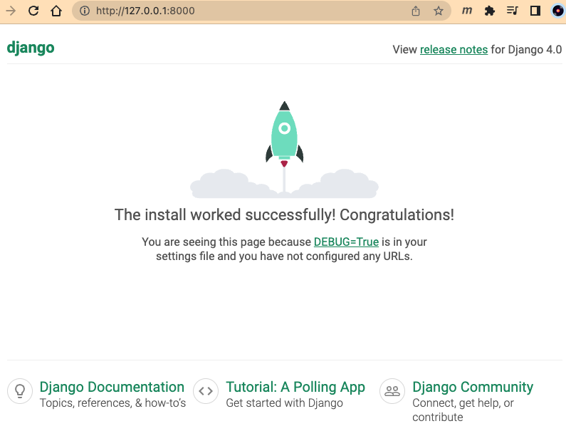  

  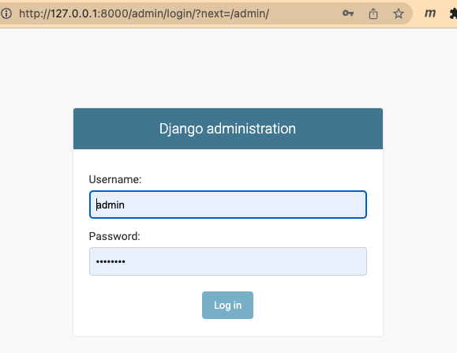  

- In case of Error `_sqlite3`  
    ```bash
    File "/usr/local/lib/python3.7/sqlite3/dbapi2.py", line 27, in <module>
        from _sqlite3 import *
    ModuleNotFoundError: No module named '_sqlite3'
  ```
    OR  
  ```bash
    File "/home/andys/.venv/lib/python3.9/site-packages/django/db/backends/sqlite3/_functions.py", line 45, in register
        create_deterministic_function("django_date_extract", 2, _sqlite_datetime_extract)
    django.db.utils.NotSupportedError: deterministic=True requires SQLite 3.8.3 or higher
  ```

  - Solution: changing the database from `sqlite3` to `pysqlite3`   

    ```bash
      pip3 install pysqlite3
      pip3 install pysqlite3-binary 

      vim ~/.venv/lib/python3.9/site-packages/django/db/backends/sqlite3/base.py
        # from sqlite3 import dbapi2 as Database # annotation
        from pysqlite3 import dbapi2 as Database # import pysqlite3
    ```

    Restart django server and it works.  

## urlpatterns list routes URLs to views  
- urls.py  
  ```python
    from django.contrib import admin
    from django.urls import path
    from movies import views

    urlpatterns = [
        path('admin/', admin.site.urls),
        path('', views.home),
        path('movies/', views.movies),
    ]
  ```

## create views - response with message    
- new a file - `views.py`  
  ```python
    from django.http import HttpResponse

    def movies(request):
        return HttpResponse("Hello there!") 
    
    def home(request):
        return HttpResponse("home page!")
  ```
  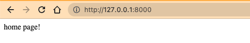  

## create views - render the template   
- update `movies` in views.py  
  ```python
    from django.http import HttpResponse
    from django.shortcuts import render

    data = {
        'movies': ['movie1', 'movie2']
    }

    def movies(request):
        # return HttpResponse("Hello there!")
        return render(request, 'movies/movies.html', data)

    def home(request):
        return HttpResponse("home page!")

  ```

- create ./templates/movies/movies.html `template`  
  ```
    {{movies}}
  ```

- update `INSTALLED_APPS` in settings.py   

  ```python
    # Application definition

    INSTALLED_APPS = [
        'movies',
        'django.contrib.admin',
  ```

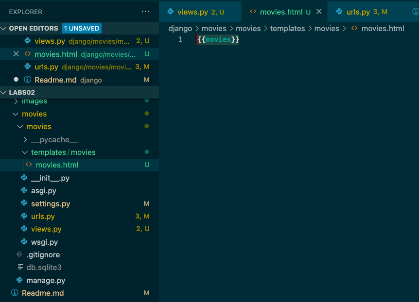  

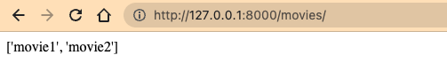  

## mock data from dictionary   
- expand `data`(movies) in views.py   
  ```
    data = {
        'movies': [
            {
                'id': 5,
                'title': 'Jaws',
                'year': 1998
            },
            {
                'id': 6,
                'title': 'Sharknado',
                'year': 2001
            },
            {
                'id': 7,
                'title': 'The Meg',
                'year': 2010
            }
          
        ]
    } 
  ```
  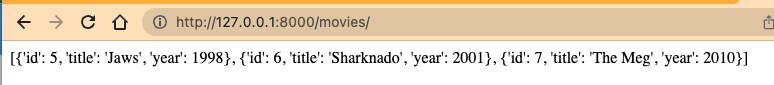   

- loop through movies data in ./templates/movies/movies.html `template`  
  `{{movie.title}}`   

  ```html
    <!DOCTYPE html>

    <html>
        <head> 
          <meta charset="utf-8">
          <title> movies </title> 
        </head>
        
        <body>
          <h1>Movies</h1>

          <ul>
          
            <li>{{movie.id}}, {{movie.title}}, {{movie.year}}</li>
            
          

          </ul>
        <body>
    </html>
  ```
  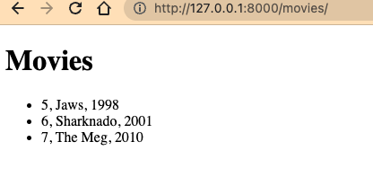  

## Migrate & createsuperuser (password)   

  ```bash
    (.venv) $ python manage.py migrate
      Operations to perform:
        Apply all migrations: admin, auth, contenttypes, sessions
    (.venv) $ python manage.py createsuperuser 
      Username (leave blank to use 'andy.shao'): admin
      Email address: user@email.com
      Password: 
      Password (again): 
      This password is too common.
      Bypass password validation and create user anyway? [y/N]: y
  ```

## Define `Movie` data model (db.sqlite3)   
- Create a file - `models.py`   
  ```python
    from django.db import models  

    class Movie(models.Model):
        title = models.CharField(max_lenth=200)
        year = models.IntegerField()
  ```

- `makemigration` of the Model in app `movies`  

  ```bash
    (.venv) $ python manage.py makemigrations movies
      Migrations for 'movies':
        movies/migrations/0001_initial.py
          - Create model Movie
  ```

- Verify 0001_initial.py   
  ```python
    from django.db import migrations, models

    class Migration(migrations.Migration):
        initial = True

        dependencies = [
        ]

        operations = [
            migrations.CreateModel(
                name='Movie',
                fields=[
                    ('id', models.BigAutoField(auto_created=True, primary_key=True, serialize=False, verbose_name='ID')),
                    ('title', models.CharField(max_length=200)),
                    ('year', models.IntegerField()),
                ],
            ),
        ]
  ```

- Optional) `sqlmigrate` `Movie` in `movies` app   
  `sqlmigrate` doesn't actuall do anything but only:  
  Prints the SQL statements for the `named migration`.  

  ```bash
    (.venv) $ python manage.py sqlmigrate movies 0001
      BEGIN;
      --
      -- Create model Movie
      --
      CREATE TABLE "movies_movie" ("id" integer NOT NULL PRIMARY KEY AUTOINCREMENT, "title" varchar(200) NOT NULL, "year" integer NOT NULL);
      COMMIT;
  ```

- Apply the migration of `moview` app  
  **Note**) `movies` in the app list  
    You may also use:  `python manage.py migrate movies`  
  ```python
    (.venv) $ python manage.py migrate 
      Operations to perform:
        Apply all migrations: admin, auth, contenttypes, movies, sessions
      Running migrations:
        Applying movies.0001_initial... OK
  ```

## Add the new table `Movie` to Admin page    
- create admin.py and register `Movie` to Admin page  
  ```python
    from django.contrib import admin
    from .models import Movie  

    admin.site.register(Movie)
  ```

- restart server  
  `(.venv) $ python manage.py runserver` ## listens on 127.0.0.1 loopback only  
  `(.venv) $ python manage.py runserver 0.0.0.0:8000`  ## to listen on every interface on port 8000  

- Verify the table on Admin page   
  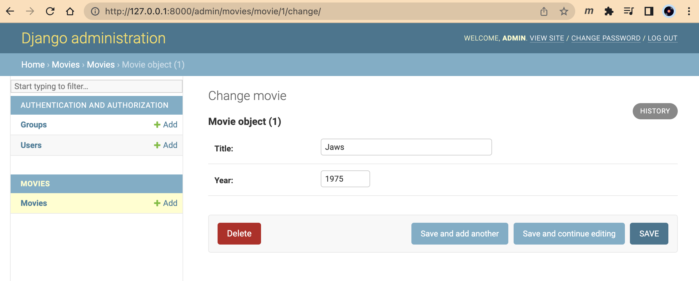  

  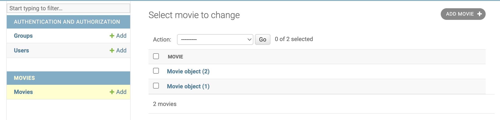  

- Improve the description of the table object: Movie object (2)  
  override a method inside the model 
  ```python
    class Movie(models.Model):
        title = models.CharField(max_length=200)
        year = models.IntegerField()
        
        def __str__(self):
            return f'{self.title} from {self.year}'
  ```

- Verify the table on Admin page   

  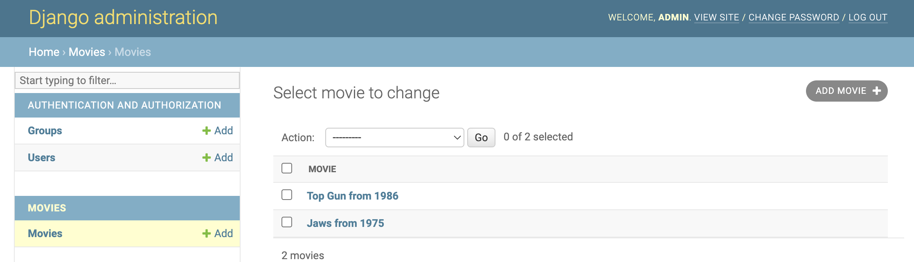   

## Query data from the database   
- Modify views.py   
  ```python
    ...
    from .models import Movie     # new

    def movies(request):
        data = Movie.objects.all()   # new

        # return HttpResponse("Hello there!")
        # return render(request, 'movies/movies.html', data)
        return render(request, 'movies/movies.html', {'movies': data})   # new

    ...

  ```
  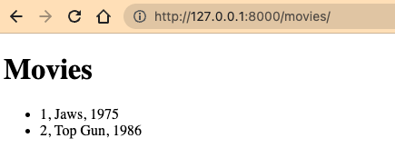  

## Detail View/Template  
- new `detail` view in `views.py`  
  ```
    ...
    def detail(request, id):
        data = Movie.objects.get(pk=id)
        return render(request, 'movies/detail.html', {'movie': data})
  ```
  
- new URL o views.detail `urls.py`  
  ```python
    urlpatterns = [
        ...
        path('movies/<int:id>', views.detail),
        ...
  ```

- detail.html template   
  ```html
    <ul>
      <li>{{movie.id}}, {{movie.title}}, {{movie.year}}</li> 
    </ul>
  ```

- Anchor the link to `detail.html` in movies.html    
  ```html
    
      <!--  <li>{{movie.id}}, {{movie.title}}, {{movie.year}}</li>  -->
      <li><a href={{movie.id}}>{{movie.title}}</a></li>
    
  ```

  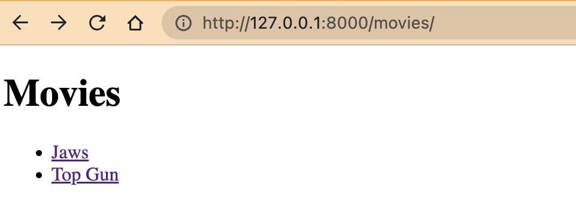  

  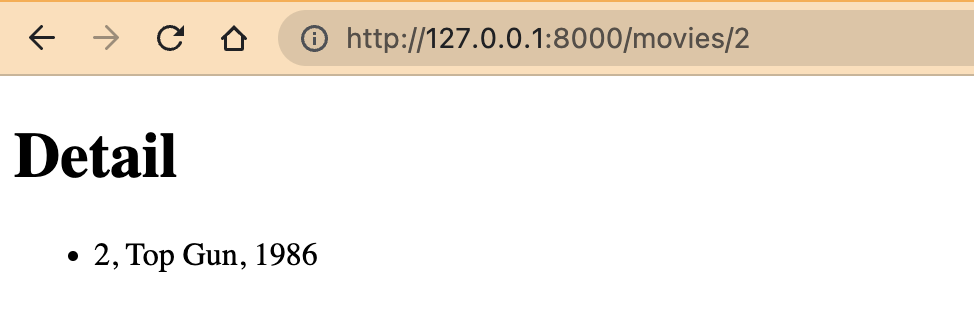  

## Create a movie  
- new url to `urls.py`  
  ```
    path('movies/add', views.add),
  ```

- Add a link to `movies/add` in movies.html   
  ```html  
    <a href='movies/add'> Add movie </a>
  ```

- new view `add` in `views.py`
  ```
    from django.http import HttpResponseRedirect   
    ...
    def add(request):
        title = request.POST.get('title')
        year = request.POST.get('year')

        if title and year:
            movie = Movie(title=title, year=year)
            movie.save()
            return HttpResponseRedirect("/movies")

        return render(request, 'movies/add.html')
  ```

- add.html template   
  ```html
    <form action="/movies/add" method="POST">

      <input type="text" name="title" id="title" placeholder="Movie title">
      <input type="text" name="year" id="year" placeholder="Movie year">
      <input type="submit" value="Add">
    </form>
  ```
  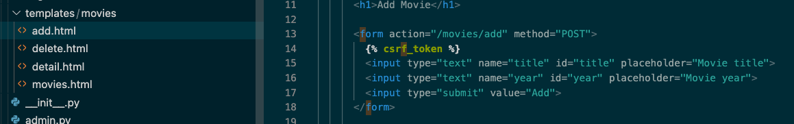  
  
- Error if `csrf_token` not presents    
  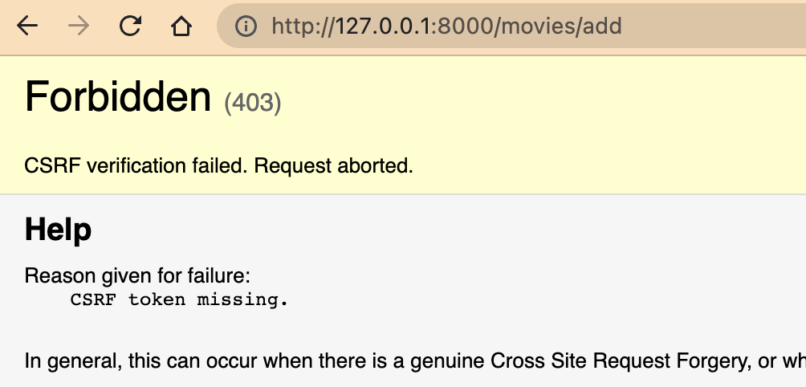   

- inspect the `add` POST payload    
  `Network / Payload`  
  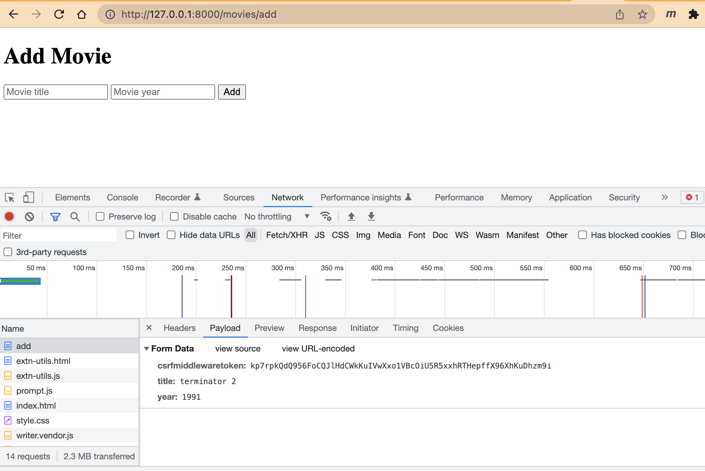  

- excercise  
  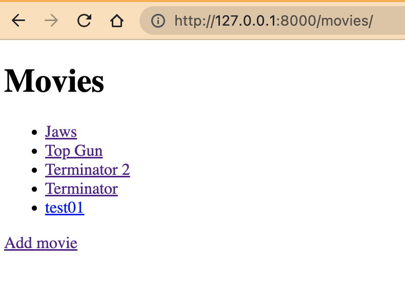  

  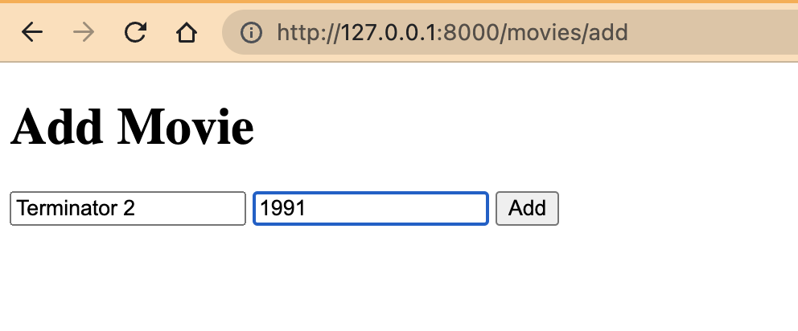  

  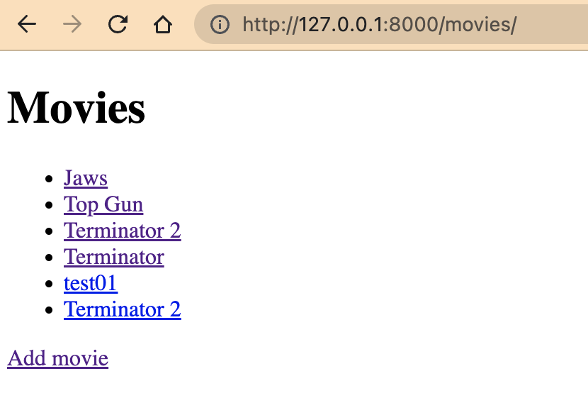  

## Delete a movie   
- new url to `urls.py`  
  ```
    path('movies/delete', views.delete),
  ```

- Add a link to `movies/delete` in detail.html   
  ```html  
    <a href='movies/delete'> Delete movie </a>
  ```

- new view `delete` in `views.py`
  ```
    def delete(request, id):
        movie = Movie.objects.get(pk=id)
        movie.delete()
        return HttpResponseRedirect("/movies")
  ```

- excercise  
  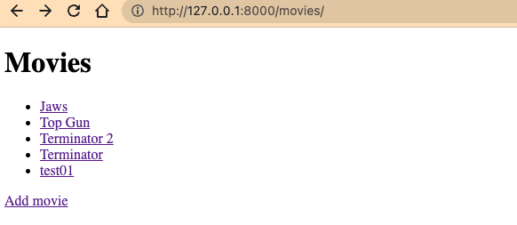  

  **Note**) When `test01` clicked:   
  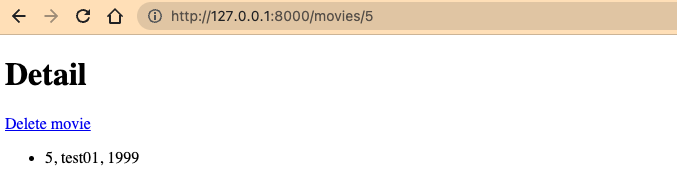  
  
  **Note**) When `Delete movie` clicked:   
  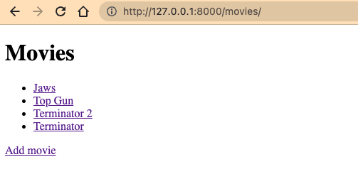  

## Exception Handling of Delete   
- test with a non-existing ID ( `111` )  

- DEBUG on (default)  
  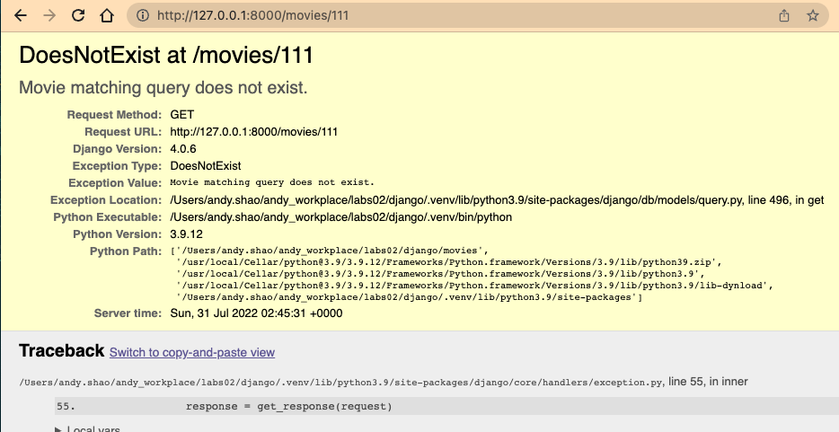  

  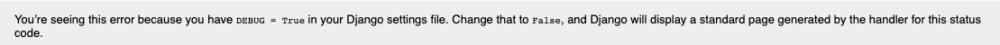  

  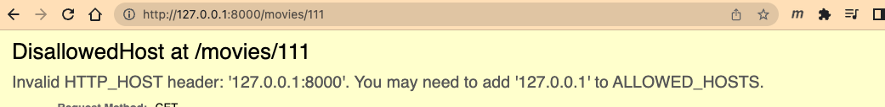 

- DEBUG off in `settings.py`
  ```python  
    # DEBUG = True
    DEBUG = False
    # ALLOWED_HOSTS = []
    ALLOWED_HOSTS = ['localhost']
  ```

  Bad Request (400)   
  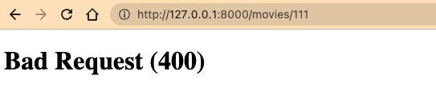    

- Change `localhost` to `127.0.0.1`  
  ```python  
    # DEBUG = True
    DEBUG = False

    # ALLOWED_HOSTS = []
    ALLOWED_HOSTS = ['127.0.0.1']
  ```

  Server Error (500)  
  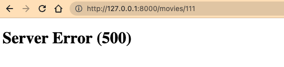  

# Django REST Framework - Build an API from Scratch  
- Ref: https://youtu.be/i5JykvxUk_A   

- Continued with the above `movies` project  

- Install `restframework`  
  ```bash
    (.venv) $ pip install djangorestframework   
  ```
  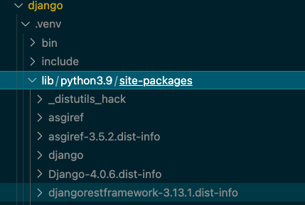  

- update `INSTALLED_APPS` in settings.py  

  ```python
    # Application definition

    INSTALLED_APPS = [
        'rest_framework',
        'movies_rest',
        'django.contrib.admin',
  ```

- Serialize JSON Object to JSON format in serializers.py  
  ```
    from rest_framework import serializers
    from .models import Drink

    class MovieSerializer(serializer.ModelSerializer):
        Class Meta:
            model = Movie
            fields = ['id', 'title', 'year']
  ```

- new REST url in `urls.py`  
  ```
    path('movies_rest/', views.movie_list),
  ```
- new view `movie_list` in `views.py`
  ```
    from django.http import JsonResponse
    from .serializers import MovieSerializer

    def movie_list(request):
        movies = Movie.objects.all()
        serializer = MovieSerializer(movies, many=True)
        return JsonResponse({"movies": serializer.data}, safe=False)
  ```

- verify the REST API server   
  `http://127.0.0.1:8000/movies_rest/`  
  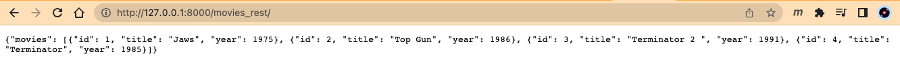   
